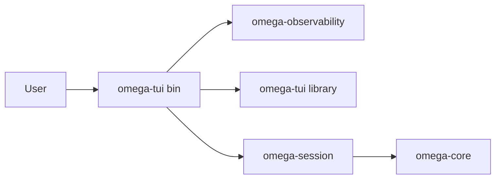
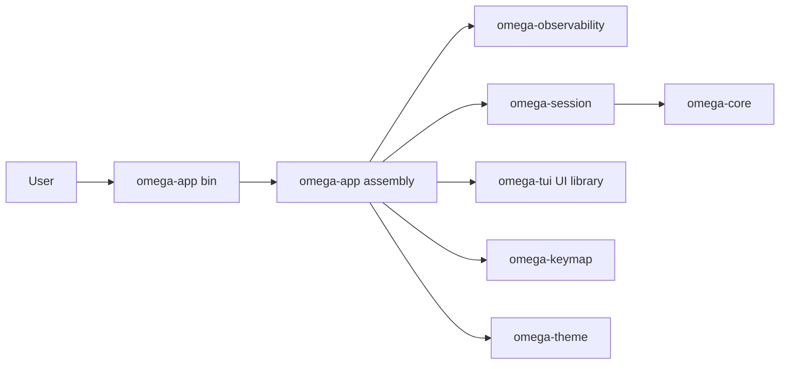

# Omega App Package Specification

## Overview

当前仓库已经把 `omega-tui` 收敛为 library-first crate，并把 `omega-session` 与 `omega-observability` 从其中剥离出来；本任务已进一步把用户入口从 `omega-tui/src/main.rs` 迁移到新的 `omega-app`。这样 `omega-tui` 不再同时承担“UI crate”和“应用装配入口”两种身份，后续 config/bootstrap/runtime coordination 也不再回流到 UI 包里。

本规格定义新的目标：新增 `omega-app` 作为唯一应用装配包与唯一 `main` 入口，负责组装 `omega-tui`、`omega-session`、`omega-observability`、`omega-keymap`、`omega-theme`、`omega-core` 与 provider/config；`omega-tui` 只保留 UI 状态、reducer、事件适配与渲染，不再拥有用户入口。

## Goals

- 新增 `omega-app` 作为唯一用户入口与顶层装配包。
- 将 `main` 从 `omega-tui` 迁移到 `omega-app`，让 `omega-tui` 成为纯 UI crate。
- 让 runtime bootstrap、config 加载、tracing 初始化、session/runtime bridge 装配都由 `omega-app` 负责。
- 保持 `omega-session` 负责 orchestration，`omega-tui` 负责 UI，避免出现新的 God crate。
- 为未来接入其他前端或 launcher 模式保留清晰的顶层应用边界。

## Non-Goals

- 本任务不要求现在就引入第二种前端。
- 不在本轮把 `omega-app` 扩张成新的业务运行时框架或隐藏服务定位器。
- 不要求 `omega-core` 理解 UI、terminal 或 app-shell 语义。
- 不在本轮改变 workflow、runtime UI contract 或 step asset model 的核心领域所有权。

## Problem Statement

如果继续让 `omega-tui` 保有 `main`：

- `omega-tui` 会继续吸收 config/bootstrap 代码，破坏 `006` 已建立的 UI-only 边界。
- `omega-session` 的 runtime bridge、`omega-observability` 的 tracing 初始化，以及未来 keymap/theme/config 的装配位置会重新变得模糊。
- 任何与应用启动、provider 选择、cwd/system/runtime handle 相关的变更，都需要修改 UI crate，形成 shotgun surgery。

## Architecture

### Previous Packaging

### Current Packaging

### Core Responsibilities

| Component | Must Own | Must Not Own |
|-----------|----------|--------------|
| `omega-app` | entrypoint, config/bootstrap, dependency wiring, session/UI assembly, runtime handle ownership | widget state, rendering, workflow policy, tool execution internals |
| `omega-tui` | reducer, UI state, render, event adaptation, terminal lifecycle | provider config, session construction policy, tracing bootstrap, `main` |
| `omega-session` | turn orchestration, runtime bridge emission, session-owned assets | terminal lifecycle, app bootstrap, widget logic |
| `omega-observability` | tracing bootstrap, sinks, ANSI cleanup | app-specific workflow policy or UI state |

### Dependency Direction

- `omega-app` -> `omega-tui`
- `omega-app` -> `omega-session`
- `omega-app` -> `omega-observability`
- `omega-app` -> `omega-keymap` / `omega-theme`
- `omega-session` -> `omega-core`
- `omega-tui` may consume contract types, but should not own runtime orchestration setup

### Package Shape

推荐形态：`omega-app` 同时包含 `src/lib.rs` 与 `src/main.rs`。

- `src/main.rs`: 仅负责进程入口和错误退出码。
- `src/lib.rs`: 承载 `run()`、config 解析、bootstrap、session/tui wiring。

这样可以保持唯一主入口，同时让装配逻辑具备单测或 smoke test 的切入点。

## Integration Boundaries

### `omega-app` Should Assemble

- LLM client/provider config
- cwd / system prompt / runtime handle
- tracing init and log sink setup
- keymap/theme/workflow config loading 入口
- `RuntimeUiBridge` 与 `RuntimeUiSink` 的 concrete channel wiring
- `AgentSession` 与 TUI runtime 的装配

### `omega-tui` Should Receive

- 已准备好的 session-facing sender/receiver 或 trait object
- 已初始化的 theme/keymap/runtime config
- 已装配好的日志/活动通道
- 应用层传入的 startup context

### `omega-tui` Should Stop Doing

- 自己创建顶层 `main`
- 自己决定 provider/config/cwd 的装配流程
- 自己初始化全局 tracing
- 自己成为其他 runtime 模块的协调中心

## Migration Plan

### Phase 1: 先固化文档与任务边界

1. 新增本规格，明确 `omega-app` 的角色。
2. 更新 `Task 15` 规划、`TODO` 与运行时规格，使后续任务都以 `omega-app` 为装配入口。
3. 将 `omega-tui` 文档中的“唯一用户入口”改写为“由 `omega-app` 装配的 UI consumer”。

### Phase 2: 新建 `omega-app` crate

1. 创建 `crates/omega-app/Cargo.toml`
2. 创建 `crates/omega-app/src/lib.rs`
3. 创建 `crates/omega-app/src/main.rs`
4. 将工作区运行命令迁移为 `cargo run -p omega-app`

### Phase 3: 迁移 `main` 与 bootstrap

1. 将 `omega-tui/src/main.rs` 中现有装配逻辑迁入 `omega-app`
2. 将 `omega-tui` 收敛为不含 binary target 的 UI crate
3. 明确 `omega-app` 到 `omega-session` / `omega-tui` 的构造参数边界

### Phase 4: 补齐验证与收尾

1. 更新开发指南与 README
2. 运行 `cargo build` / `cargo test`
3. 确认 `omega-tui` 中不再残留 app bootstrap 逻辑

## Risks

| Risk | Level | Mitigation |
|------|-------|------------|
| `omega-app` 变成新的 God crate | High | 只允许它做装配，不承载 workflow policy 或 widget state |
| `omega-tui` 仍偷偷保留 bootstrap 逻辑 | High | 明确 API 输入边界，并在文档中列出 must-not-own |
| runtime bridge ownership 模糊 | Medium | 统一写明 `omega-session` 产出协议，`omega-app` 负责 wiring，`omega-tui` 负责消费 |
| 迁移期间运行命令与文档不一致 | Medium | `README`、`guide`、`TODO` 同步更新 |

## Testing Strategy

- `omega-app`: smoke test `run()` 的基本装配路径，验证依赖 wiring 与错误传播。
- `omega-tui`: 保持 reducer/render/event 测试，不因入口迁移而重新承担 bootstrap 行为。
- `omega-session`: 保持 orchestration 与 runtime bridge 测试。
- workspace checks: `cargo fmt --all`, `cargo build`, `cargo test`.

## Acceptance Criteria

- `omega-app` 成为唯一 `main` 所在 crate。
- `omega-tui` 不再拥有应用入口，只保留 UI 相关代码。
- 顶层 config/bootstrap/tracing/session wiring 都迁入 `omega-app`。
- Task 15 后续文档与 TODO 全部以 `omega-app -> omega-tui + omega-session + omega-observability` 为目标路径。

---

### Change Log

- 2026-03-20: 初版规格，定义 `omega-app` 作为新的唯一应用装配包与 `main` 入口。
- 2026-03-20: 规格已落地实现；`omega-app` 已加入 workspace，`omega-tui` binary entry 已迁出。