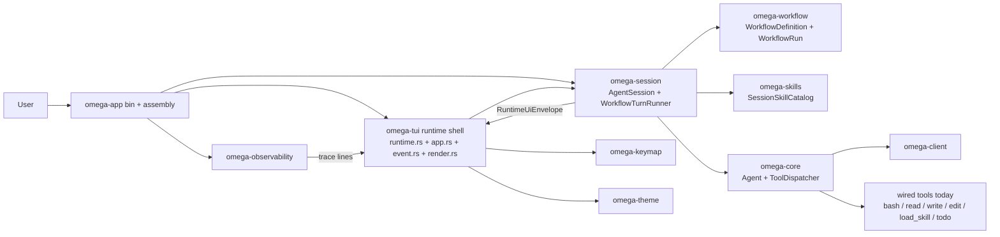
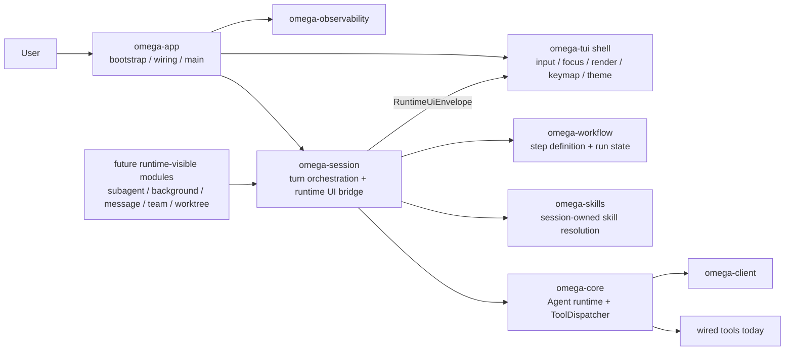

# Omega Runtime UI Message Contract Specification

## Overview

当前 `RuntimeUiEnvelope` 已不再是默认主路径，而是保留为 compat surface：runtime 主链路现已切到 `docs/specs/omega-runtime-message-pipeline.md` 中定义并实现的 `RuntimeMessageEnvelope { turn_id, message }`，由 `omega-app` 装配 `RuntimeMessagePolicy`，再交给 `omega-tui` runtime + `TuiEngine` 消费。`RuntimeUiEnvelope` 仍保留在 `omega-session` 中，用于 legacy adapter、现有 reducer 测试与平滑迁移。

本规格保留为 `Task 15F-3` 的 implemented baseline 记录：它解释了 `RuntimeUiEnvelope` / `RuntimeUiEffect` / `TuiUpdateReducer` 这套旧 contract 是如何建立起来的，以及为什么它最终需要收敛到 message pipeline。当前要看运行中的主路径，请以 `omega-runtime-message-pipeline.md` 为准；当前要看 legacy/compat contract 或旧 reducer 的历史基线，请继续看本文件。

当前补充说明：本规格的已实现部分已经覆盖 workflow / tool / todo / routing，以及 `Task 15F-6` / `Task 15B-20` / `Task 15B-21` / `Task 15F-7` 组合出的 response timeline + tool lifecycle foundation：`omega-session` 现在不仅可以发出 `BeginResponseSection` / `AppendResponseSection` / `CompleteResponseSection`，也可以发出 `BeginToolRun` / `UpdateToolRun` / `CompleteToolRun`。其中 `ToolRun` 以 stable `tool_use_id`、`parent_section_id`、`status`、`invocation_preview`、`result_preview` 与 detail lines 描述 step 内工具调用；`omega-tui` 当前已经兼容该 effect 扩展，并继续保留现有 `ResponseSectionKind::{Routing, Step, FinalAnswer, Thinking}` timeline 渲染。`Thinking` section 在流式阶段实时可见，完成后默认折叠为摘要，并受 `.omega/tui.toml` 的 `[response].show_thinking` 开关控制。自 2026-04-08 起，compat contract 也已覆盖 routed skill loading：`ActivityTarget::Skills`、`RuntimeUiEffect::UpsertSkillLoadSummary` 与对应 `StateMessage::SkillLoadSummary` 已落地，用于把 root `load-skills` 的 recognized / loaded / ignored summary 同时投递到 Response 与 Sidebar `Skills` 视图。

## Goals

- 为 workflow step 正文结果提供比当前特例化 `SessionUpdate` 更稳定的输出协议。
- 为所有未来 runtime-visible 能力建立统一的“消息 + UI 效果”对接方式，而不是让每个 crate 自己设计一套前端接口。
- 允许 `omega-tui` 基于模块与消息类型做样式化渲染，而不是让业务模块理解具体 widget。
- 为未来扩展多种渲染样式、多个 Activity view、更多底部状态槽与 overlay 交互提供稳定架构。
- 保持 `omega-tui` 只负责 UI 状态与渲染，不让非 UI 模块直接操纵 widget 细节。

## Non-Goals

- 本规格不要求现在就引入第二套前端或 GUI；当前消费者仍以 `omega-tui` 为主。
- 不在本轮把 `omega-session` 替换成完整事件总线框架或 actor runtime。
- 不允许业务模块直接调用 `omega-tui` 内部 API、直接获取 widget 句柄或发出布局指令。
- 不把 cross-module domain communication 一律改成 UI bus；该协议只用于“面向前端呈现”的运行态输出。

## Problem Statement

当前方案有三个结构性问题：

- `SessionUpdate` 已开始同时承担 workflow status、正文内容、tool preview、todo refresh 与 turn lifecycle，多能力继续接入后会膨胀成大而脆弱的枚举。
- 非 UI 模块缺少统一的“我希望把这段内容显示给用户”接口，只能在 session 层为每个 feature 单独加特例转发。
- `omega-tui` 目前根据具体 update 逐项写映射逻辑，这会让“输出归属哪个模组、采用什么样式、是否触发额外 UI 变化”分散在多个 match 分支里，难以扩展。

## Current State Snapshot

在继续定义 `omega-session` 与 `omega-tui` 的协议之前，必须先固定当前唯一的用户交互主路径：

- `omega-tui` 已经通过 `omega-session` 走 workflow-aware 的 turn orchestration 路径，并且当前作为由 `omega-app` 装配的唯一终端 UI consumer。
- `omega-core` 的 `Cargo.toml` 声明了 `omega-subagent`、`omega-compression`、`omega-tasks`、`omega-background`、`omega-message`、`omega-team`、`omega-worktree` 等未来 crate 依赖，但当前主路径里并没有实际引用这些 crate；`create_default_tools()` 当前只注册 `bash`、`read_file`、`write_file`、`edit_file`、`load_skill`、`todo`。

补充一个新的实现前提：当前真实入口已经是 `omega-app bin`。因此本规格必须同时区分“当前消费者是谁”和“由谁完成 bridge/sink wiring”。

这意味着后续规划不能把“仓库里已经有这些 crate”误判为“主交互路径已经接通这些能力”。当前真正需要固定的是：谁是交互壳层，谁拥有 turn orchestration，谁拥有 agent runtime，谁只是未来的 runtime-visible producer。

### Current Actual TUI Path



### Business Interpretation

以业务视角看，当前真正成立的是：

- `omega-tui` 已经是一个带 workflow、todo、logs 和 tracing 的 richer shell，但当前只作为由 `omega-app` 装配的 UI consumer。
- `omega-app` 是当前唯一的用户入口，并持有 bootstrap 与 channel wiring。
- `omega-session` 当前是 TUI shell 与 agent runtime 之间的会话编排边界。

因此，后续规划不再需要围绕双入口做协调；合理方向是保持 `omega-session` 作为 TUI shell 与 agent runtime 之间唯一的会话编排边界。

## Core Design

### Design Summary

引入一个显式注入的 runtime UI bridge，由 `omega-session` 持有，其他运行时模块通过它发送统一协议消息。协议分为两层：

- `RuntimeUiMessage`: 用户可阅读或可归档的内容消息。
- `RuntimeUiEffect`: 触发 UI 状态变化的效果请求。

这两层共同组成稳定 envelope，由前端消费者决定如何渲染，而不是由生产方决定具体 widget 行为。

### Recommended Direction

可以把用户提出的 `send_message(mod, messages)` 理解为正确方向，但不建议直接用字符串模块名 + 松散 payload。推荐演进为 typed API：

```rust
ui_bridge.send(RuntimeUiEnvelope::Message(RuntimeUiMessage {
    target: UiTarget::Response,
    source: UiSource::WorkflowStep {
        step_id: "plan".to_string(),
        step_label: "Plan".to_string(),
    },
    kind: UiMessageKind::Narrative,
    content: UiContent::Text("Draft implementation plan".to_string()),
    priority: None,
}));

ui_bridge.send(RuntimeUiEnvelope::Effect(RuntimeUiEffect::SetStatusSlot {
    slot: StatusSlot::Workflow,
    value: StatusValue::Label("Plan 2/4".to_string()),
}));
```

## Architecture

### Components

- `RuntimeUiBridge`: session-owned protocol emitter，负责向 UI sink 发送 runtime UI envelope。
- `RuntimeUiEnvelope`: 统一消息封套，包含 `Message` 与 `Effect` 两类。
- `RuntimeUiMessage`: 面向用户或 Activity view 的结构化内容消息。
- `RuntimeUiEffect`: 面向 UI 状态变化的结构化效果请求。
- `RuntimeUiSink`: 前端消费者接口；当前由 `omega-tui` 实现。
- `TuiUpdateReducer`: `omega-tui` 内部 reducer，把 envelope 映射为 `App` 状态。

### Core Trait Signatures

```rust
/// Bridge: session-owned emitter，runtime modules 通过它发出 UI 协议消息。
pub trait RuntimeUiBridge: Send + Sync {
    fn send(&self, envelope: RuntimeUiEnvelope);
}

/// Sink: 前端消费者拉取 envelope 的接口。
pub trait RuntimeUiSink {
    fn try_recv(&self) -> Option<RuntimeUiEnvelope>;
}
```

首轮实现可直接使用 `mpsc::Sender<RuntimeUiEnvelope>` / `mpsc::Receiver<RuntimeUiEnvelope>` 作为 bridge/sink 的具体后端，trait 先行定义边界以保证可测试性。

### Ownership

- `omega-session`: 拥有 runtime-visible 事件归一逻辑，并产出 bridge 所需 envelope。
- `omega-app`: 拥有 bridge/sink 的 concrete wiring 与应用启动生命周期。
- `omega-workflow` / future runtime modules: 只产出领域事件或通过 session context 调用 bridge，不理解 TUI 细节。
- `omega-tui`: 只实现 sink/reducer/render，不拥有上游 runtime orchestration。

### Dependency Direction

- runtime producers -> `omega-session` bridge/context
- `omega-app` -> concrete bridge/sink wiring
- `omega-session` -> runtime UI contract types
- `omega-tui` -> runtime UI contract types
- runtime UI contract types must not depend on `ratatui`

### Business-Centric Target Relation

下面的目标图不是“所有 crate 都已落地后的终局图”，而是为后续 `15F-3` / `15B-18` / `subagent/background/message/team/worktree` 接入建立一个稳定的依赖方向：



这里需要固定的关系是：

- `omega-tui` 是交互壳层，不是业务 runtime 的协调中心。
- `omega-app` 是应用装配壳层，负责把 session、observability 和 UI consumer 连接起来。
- `omega-session` 是会话编排与 runtime-visible 归一边界，不是 widget owner。
- `omega-core` 继续保持 agent runtime 和工具分发层，不感知 TUI surface。
- future runtime-visible 模块接入时，应先接到 `omega-session`，再由 session 统一对接 UI 协议，而不是各自直连 `omega-tui`。

### Current Runtime Connectivity Matrix

| Module | In Cargo Graph | On Current User Path | Role Today |
|--------|----------------|----------------------|------------|
| `omega-tui` | yes | yes | terminal shell |
| `omega-session` | yes | yes | workflow-aware turn orchestration |
| `omega-workflow` | yes | yes | step config + run state |
| `omega-skills` | yes | yes | skill prompt loading |
| `omega-core` | yes | yes | agent runtime + tool dispatch |
| `omega-observability` | yes | yes | tracing bootstrap + line sink |
| `omega-keymap` | yes | yes | TUI interaction config |
| `omega-theme` | yes | yes | TUI visual config |
| `omega-todo` | indirect | yes | todo tool via dispatcher |
| `omega-subagent` | declared in `omega-core` | no | not wired yet |
| `omega-compression` | declared in `omega-core` | no | not wired yet |
| `omega-tasks` | declared in `omega-core` | no | not wired yet |
| `omega-background` | declared in `omega-core` | no | not wired yet |
| `omega-message` | declared in `omega-core` | no | not wired yet |
| `omega-team` | declared in `omega-core` | no | not wired yet |
| `omega-worktree` | declared in `omega-core` | no | not wired yet |

这个矩阵的用途不是描述未来理想状态，而是约束后续规划：只有已经在主路径上接通的模块，才应该进入本轮的 reducer / contract / surface 设计；未接通模块先保留 target/source 语义，不应倒逼 `omega-tui` 现在就为它们做特例 UI。

## Protocol Model

### RuntimeUiEnvelope

```rust
pub enum RuntimeUiEnvelope {
    Message(RuntimeUiMessage),
    Effect(RuntimeUiEffect),
}
```

### RuntimeUiMessage

```rust
pub struct RuntimeUiMessage {
    pub target: UiTarget,
    pub source: UiSource,
    pub kind: UiMessageKind,
    pub content: UiContent,
    /// 首轮不要求消费者使用；留作后续压缩、截断或 toast 策略。
    pub priority: Option<UiPriority>,
}
```

字段语义：

- `target`: 目标 UI 模组，而不是具体 widget 实例。
- `source`: 说明消息来自 workflow step、tool、skill loader、background job 等。
- `kind`: 控制渲染语义，如正文、日志、warning、summary、result。
- `content`: 当前首期以文本为主，后续可扩展 markdown、kv summary、table-like blocks。
- `priority`: 可选字段。首轮消费者不使用，留作后续压缩、截断或 toast 策略时启用。

### Suggested Targets

```rust
pub enum UiTarget {
    Response,
    Activity(ActivityTarget),
    Todo,
    StatusBar(StatusSlot),
    Overlay(OverlayTarget),
}
```

说明：

- `Response`: 面向用户阅读的主对话流。
- `Activity`: 用于 logs / skills / delivery / delegations / background / inbox / team / worktree 等 view。
- `Todo`: 用于 turn-local plan snapshot。
- `StatusBar`: 用于稳定的底部摘要槽位，而不是自由文本。
- `Overlay`: 仅用于明确短时交互，不用于持久内容流。

### Content Model

```rust
/// 首轮以纯文本为主；后续可扩展 Markdown、KV summary、table-like blocks。
pub enum UiContent {
    Text(String),
    // future: Markdown(String), KeyValue(Vec<(String, String)>), Table { ... }
}
```

### Priority Model

```rust
/// 首轮不要求消费者使用。留作后续压缩/截断/toast 策略。
pub enum UiPriority {
    Normal,
    Low,
    High,
}
```

### Activity / StatusBar / Overlay Sub-Targets

```rust
/// Activity 子面板。当前已实现 Log / Skills；后续按模块扩展。
pub enum ActivityTarget {
    Log,
    Skills,
    // future: Delivery, Delegations, Background, Inbox, Team, Worktree
}

/// 底部状态栏固定槽位。
pub enum StatusSlot {
    Workflow,
    Agent,
    Session,
}

pub enum WorkflowRunRole {
    Root,
    Child,
}

/// 状态栏槽位值。
pub enum StatusValue {
    Label(String),
    WorkflowStep {
        workflow_id: String,
        workflow_role: WorkflowRunRole,
        step_id: String,
        step_label: String,
        index: usize,
        total: usize,
    },
    SessionRouting {
        root_workflow_id: String,
        active_workflow_id: String,
        active_workflow_role: WorkflowRunRole,
        recognized_scene_id: Option<String>,
        selected_workflow_id: Option<String>,
    },
    Hidden,
}

/// Overlay 子目标。
pub enum OverlayTarget {
    Search,
    Confirm,
    Detail,
    Picker,
    InputPrompt,
}

/// Overlay 打开请求。
pub struct OverlayRequest {
    pub target: OverlayTarget,
    pub content: UiContent,
}
```

### Suggested Sources

```rust
pub enum UiSource {
    User,
    Assistant,
    WorkflowStep {
        workflow_id: String,
        workflow_role: WorkflowRunRole,
        step_id: String,
        step_label: String,
        index: usize,
        total: usize,
    },
    SessionRouting,
    Tool { tool_name: String },
    SkillLoader,
    Subagent { agent_id: String },
    BackgroundTask { task_id: String },
    MessageBus,
    Team,
    Worktree,
    System,
}
```

### Message Kinds

```rust
pub enum UiMessageKind {
    Narrative,
    Result,
    Log,
    Warning,
    Error,
    Summary,
}
```

首期约束：

- workflow step 正文结果进入 `Response` 时，优先使用 `Narrative` 或 `Result`。
- tool preview 默认进入 `Activity(Log)`。
- task-level delivery summary 应保持可映射到 `Response` completion section、`Activity(Delivery)` 或等价 Sidebar panel，以及 `Overlay(Detail)`。
- workflow step phase change 不再伪装成正文消息，应通过 `Effect` 或 `Activity(Log)` 表达。
- scene / workflow routing 不应再以自由字符串塞进 `StatusSlot::Session` 后再由消费者反解析；应优先使用结构化 `StatusValue::SessionRouting`。
- root / child workflow 的步骤 Activity 应通过 `WorkflowRunRole + workflow_id` 明确区分，而不是只发一条无法归类的 summary 文本。

### RuntimeUiEffect

```rust
pub enum RuntimeUiEffect {
    SetStatusSlot { slot: StatusSlot, value: StatusValue },
    ClearStatusSlot { slot: StatusSlot },
    ReplacePanel { target: UiTarget, content: UiContent },
    ShowOverlay(OverlayRequest),
    HideOverlay { target: OverlayTarget },
    FocusHint { target: UiTarget },
    BeginResponseSection { section: ResponseSection },
    AppendResponseSection { id: String, delta: ResponseSectionDelta },
    CompleteResponseSection { id: String, state: ResponseSectionState },
    BeginToolRun { tool_run: ToolRun },
    UpdateToolRun { tool_run: ToolRun },
    CompleteToolRun { id: String, status: ToolRunStatus },
    UpsertSkillLoadSummary { section_id: String, summary: SkillLoadSummary },
}
```

说明：

- 不是所有 UI 变化都应表示为 message；例如更新状态栏 slot、本轮 todo snapshot 替换、overlay 打开/关闭，更适合作为 effect。
- `Response` 的流式正文与 step-owned tool lifecycle 同样属于结构化 UI 状态变化，因此分别通过 `Begin/Append/CompleteResponseSection` 与 `Begin/Update/CompleteToolRun` 表达；不设通用 `AppendMessage` effect，避免同一意图存在两条路径。
- 该层不携带具体布局指令，例如"把右栏宽度改为 40%"或"把第三个 widget 高亮成黄色"。
- 不设 `Invalidate` effect：当前 TUI 每帧全量渲染，此 effect 无可观测行为。如果未来 partial-update GUI 需要，届时再引入。

### ToolRun Model

```rust
pub struct ToolRun {
    pub id: String,
    pub parent_section_id: String,
    pub tool_name: String,
    pub status: ToolRunStatus,
    pub invocation_preview: String,
    pub result_preview: Option<String>,
    pub detail: ToolRunDetail,
}

pub enum ToolRunStatus {
    Running,
    Complete,
    Failed,
}

pub struct ToolRunDetail {
    pub title: String,
    pub lines: Vec<String>,
}
```

约束：

- `id` 应优先复用 provider `tool_use_id`，避免 session/TUI 再次自造不稳定标识。
- `parent_section_id` 用于把工具调用稳定归属到具体 step response section，而不是依赖 `Activity` 文本前缀反推。
- `invocation_preview` / `result_preview` 面向 step-level 摘要视图；`detail.lines` 面向 overlay 或 Activity drill-down。
- 兼容期内，`Activity(Log)` 的 `[tool] ...` 预览可以继续保留，但新的 step-level UI 必须优先消费 `ToolRun` 而不是解析日志字符串。

## Workflow Output Strategy

### Current Problem

workflow 现在已经有两类不同输出：

- 用户需要阅读的 step 正文结果，例如 `explore` / `plan` / `execute` 的文字产物。
- 仅用于运行态可见性的事件，例如 phase change、tool preview、todo refresh。

这两类内容不应继续靠临时 `SessionUpdate` 分支混在一起。

### Proposed Rule

- step 正文结果：发 `RuntimeUiMessage { target: Response, source: WorkflowStep, kind: Narrative | Result, ... }`
- workflow phase change：发 `RuntimeUiEffect::SetStatusSlot { slot: Workflow, ... }`，必要时再补一条 `Activity(Log)` 记录
- tool preview：发往 `Activity(Log)`
- todo snapshot：发 `ReplacePanel { target: Todo, ... }`
- final assistant reply：发 `RuntimeUiMessage { target: Response, source: Assistant, kind: Result, ... }`

这样 `Response` 的内容体验会更清晰，且 workflow 输出不再是单独的硬编码特例。

## TUI Integration Model

### TUI As Consumer, Not Peer

`omega-tui` 不应该成为其他模块直接调用的目标。正确方向是：

- 其他模块把 runtime-visible 输出交给 bridge
- bridge 把协议封装交给 sink
- `omega-tui` sink 将其 reduce 到 `App`
- `render.rs` 只消费 `App`

### Reducer Responsibilities

`omega-tui` 内部建议明确一层 reducer：

- 根据 `UiTarget` 路由到 response/activity/todo/status/overlay 状态
- 根据 `UiMessageKind` 决定默认样式与分组
- 根据 `UiSource` 提供额外标签或图标信息
- 根据窄终端规则做退化，而不是让上游模块决定

### Style Extensibility

未来若要支持多种 step 样式，不应新增新的 session update 变体，而应让 `omega-tui` 根据：

- `UiTarget`
- `UiMessageKind`
- `UiSource`

来选择不同 rendering preset。这样可支持：

- `[Plan] ...` 这种轻量前缀样式
- 单独边框 / badge 风格的 step block
- markdown-aware step rendering
- future theme-specific variants

## Injection Center Decision

### What We Need

用户提出的“全局注入中心”本质是在问：其他模块如何稳定拿到 UI 对接能力，以及模块之间如何交互。

### Recommended Choice

不建议引入隐藏式全局 service locator，也不建议让运行时模块直接互相取对方实例。推荐方案是：

- 使用显式注入的 `RuntimeContext` 或 `SessionRuntimeContext`
- 由 `omega-session` 在 turn / runtime 启动时构造上下文
- context 中暴露必要能力句柄，例如 `ui_bridge`、future `message_bus`、future `task_runtime`
- 各模块通过 context 调用稳定 trait/API，而不是查全局单例

### Why Not A Hidden Global Center

- 隐藏全局会形成新的 God Object 与隐式依赖。
- 会降低测试性，模块单测必须伪造全局注册中心。
- 会让 `omega-tui` 与 runtime modules 的边界再次变模糊。

### Acceptable "Center"

如果一定要有“中心”，它应是显式持有的 runtime context，而不是全局单例：

```rust
/// 首轮仅包含 ui_bridge。后续 crate 真正落地时按需扩展。
pub struct SessionRuntimeContext {
    pub ui_bridge: Arc<dyn RuntimeUiBridge>,
    // future (Task 3):  pub message_bus: Arc<dyn SessionMessageBus>,
    // future (Task 12): pub task_runtime: Arc<dyn TaskRuntime>,
}
```

这属于依赖注入容器，不属于 service locator。不提前引入 phantom 依赖；`message_bus` 与 `task_runtime` 在对应 crate 落地时再加入。

## Domain Communication Rule

- 面向用户可见性的输出：走 runtime UI contract
- 模块间领域协作：走 session API、domain events 或明确 trait
- 不允许业务模块直接通过 UI bridge 驱动其他业务模块

例如：

- workflow 通知 TUI 当前 step 结果 -> UI contract
- background runtime 通知 task manager 状态完成 -> domain event / runtime API
- subagent 结果最终展示给用户 -> session 归一后转 UI contract

## Planning Implications

围绕 “TUI 下的 REPL 交互” 这条主线，后续规划应按以下顺序推进，而不是继续平铺模块名：

1. 先固定 `omega-tui shell -> omega-session -> omega-core` 这一条核心业务链路。
2. 再把 `workflow / skills / todo / tracing` 这些已经真实接在链路上的能力，通过统一 runtime UI contract 收敛到 `Response / Activity / Todo / StatusBar / Overlay`。
3. 最后才让 `subagent / background / message / team / worktree` 按同一 session-owned bridge 模式渐进接入。

如果跳过第 1 步，直接从“仓库里已经有很多 crate”出发给 TUI 预留大量 feature-specific surface，最终会让 `omega-tui` 再次变成事实上的 orchestration center。

## Migration Plan

### Phase 1: 协议层 (Task 15F-3, implemented)

- 已在 `omega-session` 抽出 runtime UI contract types（`RuntimeUiEnvelope`、`RuntimeUiMessage`、`RuntimeUiEffect` 及所有子类型）
- 已定义 `RuntimeUiBridge` / `RuntimeUiSink` trait 与基于 `mpsc` 的首轮实现
- 当前已覆盖 workflow 的 step 正文结果、phase change、tool preview、todo snapshot、final reply 与 turn finish
- **`SessionUpdate` 消退策略**：已一步替换，不保留双通道过渡期。现有主路径中的 `SessionUpdate` 已移除，`omega-tui` 直接消费 `RuntimeUiEnvelope`。

### Phase 2: TUI 对接层 (Task 15B-18)

- `omega-tui` 新增 reducer / sink 层，统一消费 envelope
- 把当前 scattered `apply_session_update` 映射逻辑整理成按 target/kind/source 路由
- 明确 Response / Activity / StatusBar / Overlay / Todo 的固定映射规则
- 移除 `apply_session_update` 方法，用新 reducer 取代

### Phase 3: 其他模块接入

- `skills`、`subagent`、`background`、`message`、`team`、`worktree` 逐步改用统一协议
- 不再新增 `SessionUpdate` 特例变体

### SessionUpdate Variant → Envelope 映射表

| SessionUpdate Variant | Envelope 等价 |
|---|---|
| `ToolCallPreview` | `Message { target: Activity(Log), source: Tool, kind: Log }` |
| `TodoSnapshot` | `Effect::ReplacePanel { target: Todo }` |
| `WorkflowStepChanged` | `Effect::SetStatusSlot { slot: Workflow }` + `Message { target: Activity(Log), kind: Log }` |
| `StepText` | `Message { target: Response, source: WorkflowStep, kind: Narrative }` |
| `AssistantText` | `Message { target: Response, source: Assistant, kind: Result }` |
| `TurnFinished` | `Effect::ClearStatusSlot { slot: Workflow }` + `Effect::SetStatusSlot { slot: Agent, value: Label("Idle") }` |

## Risks

- 如果协议一开始设计得太细，会产生过度抽象。缓解：首轮仅覆盖 workflow 和已知 runtime-visible 信息。
- 如果让 effect 能直接表达任意 UI 指令，会破坏边界。缓解：effect 只允许语义级状态变化，不允许 widget/布局级命令。
- 如果把 bridge 做成全局单例，会形成新的隐藏依赖中心。缓解：坚持 session-owned context + explicit injection。
- 如果 target/kind/source 设计得过于松散，仍会退化成 stringly-typed system。缓解：首轮采用 enum + typed structs。

## Testing Strategy

- 协议层单测：验证 envelope、target、source、kind 的基础兼容与序列化/归一行为。
- session 层单测：验证 workflow step 正文结果、phase 变化、tool preview 与 todo snapshot 被正确映射到协议。
- TUI 层单测：验证 reducer 能按 target/kind/source 把消息落到正确 panel / status slot / overlay。
- 回归测试：验证新增模块接入时，不需要继续在 `App::apply_session_update` 中堆 feature-specific 特例。

## Technical Decisions

| Decision | Choice | Rationale |
|---------|--------|-----------|
| protocol owner | session-adjacent runtime UI contract | 让非 UI 模块通过统一边界对接前端 |
| content vs state split | `RuntimeUiMessage` + `RuntimeUiEffect` | 把可读内容与 UI 状态变化分开 |
| target typing | typed `UiTarget` enum | 避免 stringly-typed module routing |
| center model | explicit runtime context, not global singleton | 保持依赖可见、可测、可替换 |
| tui role | sink + reducer + renderer | 保持 TUI 只负责消费协议与渲染 |

---

### Change Log
- 2026-03-20: 初版规格，提出统一 runtime UI message/effect contract，作为 workflow output、Activity 映射与 future runtime-visible 模块的统一前端协议。
- 2026-03-20: v0.2 — 根据审查反馈补齐协议类型定义（`UiContent`、`UiPriority`、`StatusSlot`、`StatusValue`、`ActivityTarget`、`OverlayTarget`、`OverlayRequest`）；新增 `RuntimeUiBridge` / `RuntimeUiSink` trait 签名；移除 `AppendMessage` effect 消除双路径歧义；移除 `Invalidate` effect（当前 TUI 无可观测行为）；`UiPriority` 改为 `Option` 延迟消费；`SessionRuntimeContext` 首轮仅包含 `ui_bridge`，推迟 phantom 依赖；Migration Plan 新增 `SessionUpdate` 全量一步替换策略与 variant→envelope 映射表。
- 2026-03-20: v0.3 — 补充以业务路径为中心的现状依赖图，明确当前主线应以 `omega-tui shell -> omega-session -> omega-core` 为准；新增 current/target mermaid 图与 runtime connectivity matrix，用于后续规划。
- 2026-03-20: `omega-repl` 路径已移除，current-state 描述收敛为单一用户路径。
- 2026-03-20: 补充 `omega-app` 目标装配层，明确后续 bridge/sink wiring 与应用 bootstrap 应从 `omega-tui` 迁移到 `omega-app`。
- 2026-03-20: v0.4 — `Task 15F-3` 落地实现；`omega-session` 已引入 `RuntimeUiEnvelope`/`RuntimeUiMessage`/`RuntimeUiEffect` typed contract 与 `RuntimeUiBridge`/`RuntimeUiSink` trait，主路径中的 `SessionUpdate` 已移除，`omega-tui` 现直接消费统一协议。
- 2026-04-08: v0.5 — `Task 15B-47` / `Task 15B-48` 落地实现；compat/runtime contract 新增 `ActivityTarget::Skills` 与 `UpsertSkillLoadSummary`，root `load-skills` 固定动作现可把 recognized / loaded / ignored summary 暴露到 Response 与 Sidebar `Skills` 视图，并支持统一 detail overlay drill-down。
